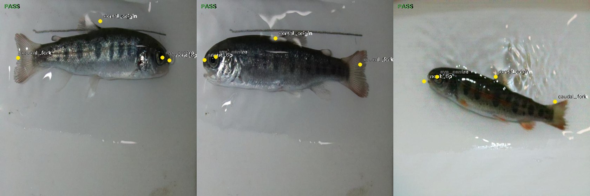
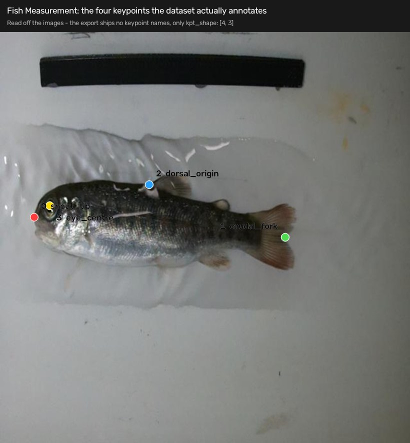
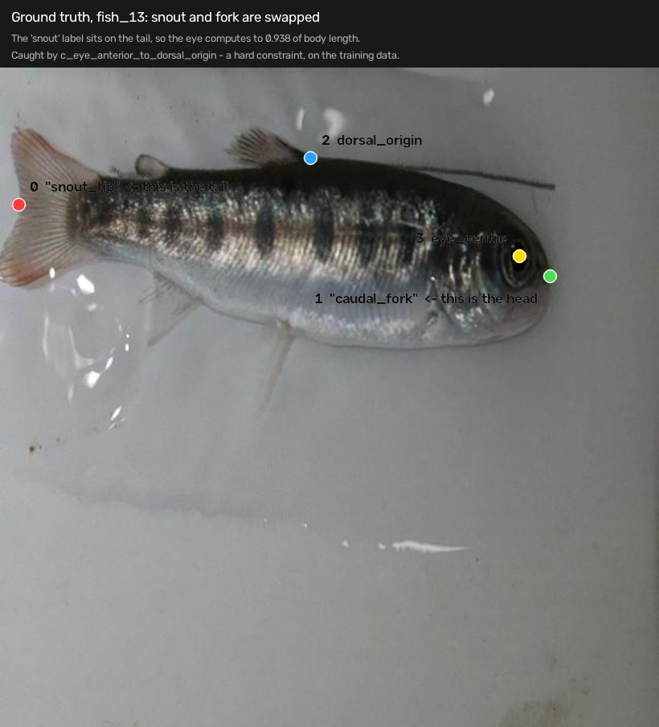

# fingerling

A single-station fish grading app. Camera or video in, real-world measurements
and a sort decision out.

Fish farms still grade by hand — net a fish, measure it with calipers, eyeball it
for deformities, write it down. About five minutes a fish, so farms only ever
measure a tiny sample of their stock, and you can't run a breeding program on a
sample that small.

The interesting engineering here isn't finding a fish in an image. That's solved.
It's everything between a model output and a decision someone will act on:
predictions come out in pixels and breeding decisions need millimetres with a
known error; a wrong measurement delivered confidently is worse than no
measurement; and the data the model trained on is never the data it sees.



Four landmarks per fish — snout, eye, dorsal origin, caudal fork — on trout parr
the model has never seen. All three PASS. All three say "uncalibrated", because
there's no calibration target in frame and the app won't print millimetres it
can't defend.

## Running it

Python 3.11+. Everything runs locally on a MacBook Pro M4 Pro, no cloud, no APIs.

```bash
python3 -m venv venv && source venv/bin/activate
pip install -r requirements.txt
python -m cli.make_sample
python -m api.server
```

Then open http://127.0.0.1:8000. That's the whole demo: live view with the
landmark overlay, the current fish's numbers, a records table, a review queue you
can correct from, and an export button.

The sample clip contains a calibration card and **no fish** — the stub detector
doesn't look at the image, so that run exercises real calibration geometry
against a fake animal. It exists so a fresh clone has something to point at.

Batch mode, no UI:

```bash
python -m cli.batch data/sample --out results.csv
```

To see the routing, edit `detector.stub_mode` in `config.yaml`: `normal`,
`deformed` (routes to CULL), `implausible` (REVIEW, with the failed constraints
named), `low_confidence`, `no_detection`.

### Running the real model

The weights live under `runs/`, which is gitignored, so you have to train first:

```bash
export ROBOFLOW_API_KEY=...
python -m eval.dataset --fetch data/fish-measurement --workspace fish-count --project fish-measurement-z2ois
python -m eval.dataset --regroup data/fish-measurement          # fixes a leak, see below
python -m eval.train --data "$PWD/data/fish-measurement-grouped/data.yaml" --epochs 100
```

About 13 minutes on MPS. Then three lines in `config.yaml`:

```yaml
detector:
  backend: yolo
  weights: runs/pose/fishmeasure_grouped/weights/best.pt
decide:
  assess_deformity: false    # this model has no midline landmarks — see below
```

## What's real and what isn't

| | |
|---|---|
| Calibration (card → homography → mm) | real, tested against synthetic scenes with known answers |
| Landmark detection | **real** — yolo11n-pose fine-tuned on 176 images of trout parr |
| Measurement, uncertainty, trust, routing | real |
| Millimetre accuracy on a photograph | **measured: 0.15 mm worst case on a good frame.** See below. |
| Deformity / CULL | **not supported by the trained model.** See below. |

## What I found

The genuinely useful part of this project turned out to be the things that went
wrong. Full detail in [docs/DATASETS.md](docs/DATASETS.md) and
[docs/DECISIONS.md](docs/DECISIONS.md).

### The dataset I'd chosen was the wrong dataset

I picked fishKeypoints in checkpoint 1 without reading its keypoint schema,
because it was the only thing I could download without signing an agreement, and
I wrote down at the time that this was a gamble. It lost. fishKeypoints is
**aerial drone footage of wild fish schools** — twelve fish per frame, each about
20 pixels long, two keypoints each. It's a biomass-counting dataset.

I switched to Fish Measurement: 245 images, one salmonid parr per frame in a
white tray, four keypoints. My own survey had dismissed it in three lines without
checking.

Nothing downstream had to be rewritten, because nothing downstream refers to a
landmark by index. Changing schema was a rename table plus one added name.

### I nearly read the schema wrong

The export ships no keypoint names at all, only `kpt_shape: [4, 3]`. Inferring
them from summary statistics gave me a clean, confident, wrong answer — I had the
tail as the snout. Rendering three images and looking at them fixed it.



### The published train/test split leaks

245 files, but only **120 source photographs**. Roboflow writes one file per
augmented copy, and the published split was made over files rather than
photographs, so **34 photographs have copies in both train and test**. The copies
aren't byte-identical, so a hash check finds nothing.

Trained on that split the model scored pose mAP50-95 of **0.953** on "held-out"
data that wasn't held out. `eval/dataset.py` now has `audit_split_leakage()` and
`regroup_split()`, and every number below comes from a retrain on a clean
group split.

### My own plausibility constraints found a mislabelled image

In the ground truth, not in a prediction. 244 of 245 fish have the eye anterior
to the dorsal fin. The exception has snout and fork swapped.



### A millimetre figure was being written from a calibration known to be bad

A test frame with no card in it found something card-shaped at obliquity 4.57 and
a 21 px residual. The row was correctly tagged `calibration_reliable: 0` — and
`fork_length_mm: 84.42` went into the database anyway. The flag was right and
nothing read it.

That's the precise failure this whole project exists to prevent, and it sat in
the code the whole time. Millimetres are now gated on `reliable`, not on
`calibrated`. A number nobody should use shouldn't exist, rather than travelling
next to a flag something else has to remember to check.

### Tilt doesn't hurt accuracy — it hurts detection

`max_obliquity` was 2.0 and nothing was behind that number. Sweeping a synthetic
scene from 1.00 to 1.71:


Error stays under 0.15 mm the whole way, because a homography undoes perspective
properly. What breaks is detection: past ~1.43 a foreshortened coin stops being
round enough to find, and past 1.71 the card isn't found. So it's set to 1.4 —
not a measured failure point, just where the evidence stops.

## Numbers

### Model, on a leak-free group split

`yolo11n-pose`, 100 epochs, 640 px, MPS, `amp=False`, `fliplr=0.0`. 735 seconds
on an M4 Pro. Trained on 176 images from 84 source photographs; tested on 27
images from 14 photographs the model never saw in any form.

| | box | pose |
|---|---|---|
| precision | 0.998 | 0.998 |
| recall | 1.000 | 1.000 |
| mAP50 | 0.995 | 0.995 |
| mAP50-95 | 0.899 | **0.991** |

Inference is 7.9 ms per image.

**Don't read much into that 0.991.** The test set is 14 photographs. I can show
you exactly how fragile a number that size is: on the original 25-image test
split, deleting the single mislabelled image moved pose mAP50-95 from **0.9534 to
0.9950** — 4.2 points, from one bad ground-truth label.

Which also means the obvious comparison doesn't work. The leaky split scored
0.953 and the clean split scored 0.991, and that is *not* evidence that fixing
the leak helped — if anything it's the wrong direction. The mislabelled fish sat
in the **old test split**, and the regrouping happened to put it in the **new
training split**, so most of that gap is one bad label moving between buckets.

What I can say is narrower and still worth saying: 0.953 was measured on data the
model had partly seen, so it was never a valid held-out number whatever its
value. Fixing the leak didn't make the score better or worse in any way I can
demonstrate at this sample size. It made the number mean something.

The honest caveat on all of it: one tray, one camera, one lighting setup, one
species, 120 photographs. It says nothing about a different hatchery. Training
data this homogeneous is a known way to ship something that works in the lab and
falls over on site, and this dataset is about as homogeneous as they come.

### Latency, 25 real frames at 640 px on MPS

| stage | p50 | p95 |
|---|---|---|
| detect | 9.87 | 18.36 |
| calibrate | 2.51 | 5.14 |
| measure | 0.03 | 0.04 |
| trust | 0.07 | 0.09 |
| **total** | **13.24** | **22.63** |

Milliseconds. Mean detect is 54.9 against a p50 of 9.87 because the first MPS
inference pays for graph setup — exactly the thing a single average would hide,
and the reason this stores p50 and p95 rather than an average.

Calibration got about 45% slower when the corner fix went in: fitting four edges
to the intensity gradient costs more than nudging four corners. On the 1280 px
sample clip it's 12.9 ms p50 rather than 2.5, because it's searching a bigger
image for the card. That's the single most expensive thing in the pipeline and
nobody has tried to make it faster.

### Measurement accuracy, on real photographs

Four phone photos: an ID-1 card as the calibration target and Canadian loonies
(26.50 mm) as the objects. Two on a hard table, two on carpet.

| | hard table | carpet |
|---|---|---|
| outline residual | **0.29 / 0.97 px** | 3.05 / 5.88 px |
| `calibration_reliable` | yes | **no** |
| bias | **+0.115 mm** (+0.43%) | −0.258 mm (−0.97%) |
| worst absolute error | **0.149 mm** | 0.404 mm |

```bash
python -m eval.validate_mm shots/ --objects loonie,loonie --working-distance-mm 350
```

So about **0.15 mm on a 26.5 mm object** when the frame passes its own quality
check, which is around 0.5%.

Two things about that table are worth more than the numbers.

**The quality signal works, and the placeholder threshold turns out to be right.**
`max_reprojection_residual_px` is 2.0 and was never more than a guess. Real
frames land at 0.3–1.0 px on a hard table and 3–6 px on carpet, so the threshold
sits cleanly between them — and the frames it accepts measure about three times
better than the frames it rejects. That's the first actual evidence that the
residual predicts measurement error rather than just being a number.

**The error model closes.** At 350 mm the coplanarity bias should be +0.29%,
because a coin's face sits about 1 mm above a card's. Measured bias on the good
frames is +0.43%. Same sign, same magnitude, and it's the one error I predicted
from geometry before measuring anything.

### The bug those photos found

The first run on real photographs came back **+2.9% high**, and the outline
residual was 14–24 px on every frame. Chasing it turned up the largest accuracy
bug in the repo.

A credit card has rounded corners — ID-1 specifies a 3.18 mm radius. So
`approxPolyDP` returns four vertices sitting *on the arcs*, inset from where the
edges would actually meet by 0.293r = **0.93 mm**. The solver was being told
those four points span 85.60 mm when they really spanned 83.74 mm of card, so
every millimetre it produced afterwards was 2.2% too big.

What made it findable: **zero of 6,460 outline points fell inside the ideal
rectangle.** Every one was outside, by a median of 0.929 mm. A uniform one-sided
offset is what an inset corner looks like — a bent card or a bad lens would
scatter to both sides. 0.93 mm predicted from the corner radius, 0.929 mm
measured.

The fix is to ignore the arcs, fit a line along each of the four straight edges,
and intersect them. The lines are fitted to the **intensity gradient**, not to
the contour: a contour is wherever the segmentation put it, and this repo's own
Canny mask is dilated, which pushes the traced outline about 2 px outward. That
bias was previously hidden by `cornerSubPix` and would otherwise have been
inherited. Each corner now comes from hundreds of edge points instead of one.

Bias on the hard-table shots went from **+0.780 mm to +0.115 mm**, and the
outline residual from 14–24 px to under 1 px.

No synthetic scene could have found this. All of mine render sharp-cornered
rectangles.

### Measurement accuracy, on synthetic scenes

0.09 mm on known diameters, across obliquity 1.00 to 1.40. That number is about
the geometry being right — no lens, no sensor noise, no coin thickness, no
lighting. Don't quote it as accuracy.

## What it can't do

- **No deformity detection with the real model.** Spinal curvature is the
  deformity proxy and it needs a midline. The dataset gives four landmarks and
  none of them are midline points, so curvature is `None` on every fish. With
  `assess_deformity: false` the system routes on trust and length and states
  "DEFORMITY NOT ASSESSED" on every record; the CULL branch is only reachable
  from the stub. No public fish keypoint dataset I could find annotates a
  midline. This is the biggest gap and it's a data problem, not a code problem.
- **The coplanarity assumption is false and unmeasured.** The fish sits above the
  calibration plane by roughly half its body depth, so every length reads
  slightly long. It's a systematic bias, so averaging frames won't remove it.
  It's the largest error in the system and it needs a tape measure, not code.
  (A stereo or depth camera is the real fix.)
- **One fish per frame.** Highest-confidence detection wins. Two overlapping fish
  is a documented failure, not something this silently averages. There's no
  tracking anywhere — each frame is an independent grading event.
- **The card aspect filter is all that identifies a card.** Anything bright,
  convex, four-sided and roughly 1.586:1 gets measured against. That's how the
  84.42 mm above happened.
- **No lens distortion model.** A lens bends straight lines and a homography
  can't express that, and it gets worse away from the optical centre. With the
  corner bug fixed this is no longer the dominant error, but it's still there
  and it's why the two coins in a frame don't agree exactly.
- **The ArUco path doesn't run.** `marker_length_mm` is null in config and the
  code refuses to invent a scale. The card path works.
- **Thresholds.** Most things in `config.yaml` are still marked PLACEHOLDER.
  Four aren't any more — the eye and dorsal position ranges came off 245
  ground-truth annotations, and `max_obliquity` came off the sweep above.

## Layout

```
pipeline/    capture, detect, calibrate, measure, trust, decide, wiring, overlay
             landmarks.py holds the schema — the one place names map to indices
api/         FastAPI server, WebSocket streaming, REST
store/       sqlite, one table, no ORM
cli/         batch.py (video -> csv), make_sample.py (demo frames)
eval/        dataset.py (fetch, leakage audit, regroup), train.py, validate_mm.py
web/         index.html — the whole frontend, one file, no build step
tests/       136 tests; 121 of them run without torch installed
docs/        CALIBRATION.md, DATASETS.md, DECISIONS.md, images/
```

`pipeline/` imports nothing from `api/`, so the pipeline is usable as a library
and testable without a server. The batch CLI and the web server run the same
`Pipeline.process`, so whatever the UI shows, the CSV shows too.

Records keep the raw landmarks and the frame path, not just the derived numbers.
If someone questions a grade I need to show exactly why the system said what it
said. A human correction never overwrites the machine's decision — the pair is
the training data for the next model.

## Tests

```bash
pytest -v
```

The ones worth reading:

- `tests/test_calibrate.py` — calibration is the part most likely to be silently
  wrong, so it gets the most tests.
- `test_subpixel_refinement_beats_the_raw_threshold` — guards a bug this repo's
  own synthetic harness found in itself: thresholding after a blur put every
  measured boundary ~0.41 mm inside the true edge.
- `test_a_naive_pixels_per_mm_would_fail_the_tilted_case` — checks that the
  tilted-measurement test actually proves something, by confirming a constant
  scale factor really would fail the same scene.
- `test_a_hash_check_would_not_have_caught_this` — why the split leak needed a
  filename rule rather than deduplication.
- `test_not_assessing_deformity_is_stated_on_every_record_it_affects` — the
  switch that makes PASS reachable must not become a silent way to stop culling.

Every test is built from an answer I chose in advance. A 200 mm fish has to
measure 200 mm; a bent midline has to score above a straight one. A test that
only asserted "returns a MeasurementSet" would pass on code that computed
nonsense.

## Not in scope

No auth, no accounts, no cloud, no multi-camera, no settings page, no dark mode.
It's a single-station operator tool. If a login form appears in this repo,
something has gone wrong.
