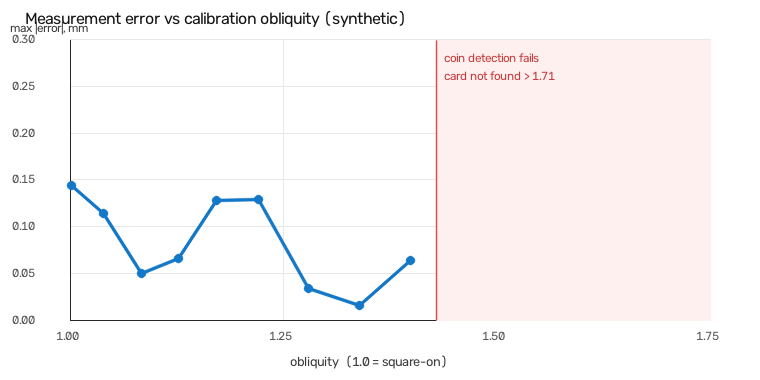

# Calibration

Turning pixels into millimetres. This is the part of the project I care most about
getting right, and it's the part most likely to be wrong in a way nobody notices.

## How it works

An object whose physical size I know exactly sits in the frame. Find its four
corners in pixel coordinates, pair them with their known positions in millimetres,
and solve a homography between the two. After that, any point on that plane
converts to millimetres with one matrix multiply.

The board-plane origin is the target's own top-left corner and the axes are its
edges. So millimetre coordinates are only comparable within a single frame. That's
fine — every trait in this project is a distance or a ratio, and both survive.

Two targets, in preference order:

**ArUco marker on my phone screen.** I pick the pixel size that produces an exact
physical size from the screen's PPI, so there's no printer scaling error to worry
about. `marker_length_mm = displayed_side_px / PPI * 25.4`. That value is null in
`config.yaml` until I look up my phone's PPI, and the code refuses to calibrate
rather than guess it.

**A credit card.** ISO/IEC 7810 ID-1 is 85.60 x 53.98 mm and every card in the
world is made to it, so I know the size to a hundredth of a millimetre without
owning a caliper. Detected as a bright convex quad whose aspect ratio is close to
85.60/53.98 = 1.586.

## The residual is not what you think it is

A homography has 8 degrees of freedom. Four point correspondences give exactly 8
equations. The system is exactly determined, so the solution reproduces those four
points perfectly and the reprojection residual is zero to floating-point noise —
**no matter how badly the target is positioned.**

My near-edge-on synthetic scene reports a residual of 0.000 px. It is a genuinely
terrible view. The residual has no opinion about that because it structurally
can't.

So results carry a `residual_meaningful` flag. For a single ArUco marker it's
False and the number is decoration. For the card it's True, because there I don't
only use the corners: I take every point of the detected outline, map it into the
board plane, and measure how far it lands from the ideal rectangle's edges. That's
over-determined, and it catches things the corner solve can't — a card that isn't
flat, a lens that bends straight lines, a sloppy segmentation.

| card | outline residual |
|---|---|
| flat, square-on | 0.92 px |
| bowed 1.5 mm at the edge midpoints | 7.11 px |

Both give four perfectly good corners. Only one of them is a card you should
measure a fish against.

## What actually catches a bad view: obliquity

Read the tilt straight off the matrix. Differentiate the homography at a point and
you get a 2x2 Jacobian whose singular values are the millimetres-per-pixel scale
along the directions that get stretched most and least. From that:

- **anisotropy** — worst `s_max / s_min` at any one point. How much the map
  stretches one direction against the other.
- **scale spread** — largest mean scale anywhere on the target over the smallest.
  How much the scale drifts across the target.

`obliquity` is the worse of the two. Flat-on it's 1.0. Rotate the target in its own
plane and it stays 1.0, because rotation is a rigid motion — that's the property
that makes it useful, since in-plane rotation is harmless and tilt is not.

Measured on synthetic scenes:

| scene | obliquity | residual |
|---|---|---|
| ArUco square-on | 1.000 | 0.000 px (not meaningful) |
| ArUco rotated 30 degrees | 1.002 | 0.000 px (not meaningful) |
| ArUco tilted, far edge at 72% | 1.640 | 0.000 px (not meaningful) |
| ArUco near edge-on | 15.507 | 0.000 px (not meaningful) |
| card square-on | 1.001 | 0.92 px |
| card rotated 30 degrees | 1.001 | 1.71 px |
| card tilted, far edge at 72% | 1.639 | 1.11 px |
| card near edge-on | not detected at all | — |

## Why tilt matters, given that the math is exact

Here's the thing that took me a moment. On a perfectly rendered synthetic frame,
the edge-on marker measures a 200 mm span as 200.09 mm. Exact corners in, exact
millimetres out. So why reject it?

Because real corners aren't exact. A tilted homography multiplies corner error far
more than a flat one does. Jitter the four corners by half a pixel and measure the
same 200 mm span 400 times:

| view | mean error on a 200 mm span |
|---|---|
| flat-on | 0.31 mm |
| near edge-on | 2.41 mm |

Roughly 7x, measuring across the far side of the target where foreshortening is
worst; about 3x on the near side. Same target size in frame in both cases, so
that's tilt and not just one target being bigger. There's a test for this
(`test_tilt_amplifies_corner_noise_and_that_is_the_point_of_obliquity`) because it
is the entire justification for the metric.

## Accuracy on synthetic scenes

Every number below is a 200 mm span in the board plane, rendered through a known
homography and measured back. These are the best case: perfect rendering, no
lens distortion, no motion blur, no lighting. Treat them as a check that the math
is right, not as an accuracy claim. Real numbers come in Phase 3, measured against
household objects of known size.

| scene | measured | error |
|---|---|---|
| ArUco square-on | 200.064 mm | +0.064 |
| ArUco rotated 30 degrees | 199.984 mm | −0.016 |
| ArUco tilted (72%) | 199.912 mm | −0.088 |
| card square-on | 199.732 mm | −0.268 |
| card rotated 30 degrees | 199.789 mm | −0.211 |
| card portrait | 199.732 mm | −0.268 |
| card tilted (72%) | 199.707 mm | −0.293 |

The ArUco span is a 5x extrapolation from a 40 mm marker; the card span is about
2.3x from an 85.6 mm card. Extrapolating further from a smaller target multiplies
corner error, which is the argument for putting the target near the fish and not
in the corner of the frame.

## What the obliquity threshold should actually be

`max_obliquity` was 2.0 and that number had nothing behind it. `eval/validate_mm`
can now settle it: render a card plus three coins of exactly known diameter on
one plane, tilt the plane, and measure the coins through the calibration.

The result is not what I expected. **Tilt does not degrade the measurement.** Max
error stays under 0.15 mm from obliquity 1.00 all the way to 1.40, with no trend
— which, on reflection, is the whole point of solving a homography. A homography
undoes perspective exactly. A pixels-per-millimetre constant could not, and
there's a test (`test_a_naive_pixels_per_mm_would_fail_the_tilted_case`) that
checks a naive scale factor really would fail the same scene, so the tilted test
isn't passing for a trivial reason.

What fails is **detection**, and it fails abruptly:

| obliquity | what happens |
|---|---|
| 1.00 – 1.40 | all three coins found, max error ≤ 0.15 mm |
| ~1.46 | a coin stops being round enough to pass the circularity filter |
| ~1.62 | no coins found |
| > 1.71 | the card itself isn't found |

So I set `max_obliquity: 1.4`. That is **not** a measured failure point — it's the
edge of the evidence. Past it I can't measure anything because nothing is
detected, so I don't know whether the geometry holds and I'm not going to imply I
do. 2.0 was worse than a guess; it was a guess that looked like a specification.

One thing this sweep can't see: it's a synthetic scene with rasterised hard
edges, no lens and no coin thickness. A real lens adds distortion that a
homography genuinely cannot express, and that gets worse toward the frame edges
and with tilt. So the real threshold is probably tighter than 1.4, not looser.

## What the synthetic sweep found in my own code

Worth recording because it's the reason the sweep existed. The first run measured
every coin **0.41 mm small** — the same absolute amount regardless of coin
diameter. A constant offset is a boundary problem; a constant percentage would
have been a scale problem. That told me where to look without any guessing.

The cause was mine: `_binarise` blurs before Otsu, the blur turns a hard edge
into a ramp several pixels wide, and Otsu's single global threshold isn't the
ramp's midpoint. On that scene it landed at 123 where the midpoint was about 93,
so every boundary cut inside its object.

Deleting the blur drops the error to 0.04 mm and is the wrong fix — the blur is
there so sensor noise doesn't shatter contours in a real photograph, and the size
of the bias depends on where Otsu lands, which depends on lighting. It's not a
constant anyone can subtract. Refining each boundary point onto the half-maximum
intensity of its own edge makes the result independent of the threshold, which is
the property that survives a change of lighting. Residual bias: **+0.14 mm**.

I stopped there. What's left is sub-pixel boundary convention on a synthetic hard
edge that has no optical blur in it, and tuning against that would be fitting to
my own renderer. Only a photograph can arbitrate it.

## What a real card does to the outline residual

Everything above was measured on rendered scenes. The first two photographs of an
actual card both came back with an outline residual of 16-18 px against a
threshold of 2.0, so both were flagged unreliable and had their millimetres
withheld.

Two causes, and only one of them was my code.

**Rounded corners.** ID-1 specifies a corner radius of 3.18 mm, so a real card is
four straight edges joined by four arcs. Measured against a sharp-cornered
rectangle each arc departs by about r(1 - 1/sqrt(2)) ~ 0.93 mm, which is enormous
next to the sub-pixel deviation this metric is for. Every synthetic scene in
`tests/` renders sharp corners, so none of them could ever have caught it.
`_outline_residual_px` now excludes a margin around each corner and measures only
the straight edges — which is what the check is really about, since a bent card
or a distorting lens bows the edges.

**The outline bled into the background, and that one is real.** Excluding the
corners barely moved the number (RMS 1.106 mm to 1.130 mm), so the corners were
not the problem. Looking at the traced contour, it follows the card cleanly on
three sides and wanders out into the carpet on the fourth, picking up bright
fibres next to a bright card. The median deviation across the whole outline was
0.956 mm — about 15 px at that scale.

I think the residual was doing its job. The card was lying on carpet, which is
compressible, so it was neither flat nor coplanar with coins pressed into the
pile beside it. A card that isn't flat is precisely what this metric exists to
notice. And the measurements from those frames came out about five times worse
than the synthetic baseline — roughly 1 mm on a 26.5 mm coin against 0.15 mm.

So the flag and the error agree, on a sample of two. That's encouraging and it
is not yet a result. `max_reprojection_residual_px` stays a PLACEHOLDER: 2.0
rejects every real photograph I have, and I am not going to pick a number that
happens to let my own two shots through. What settles it is a session on a hard,
matte, uniform surface — if the residual drops and the error drops with it, the
threshold can be set from the pair.

## Things this gets wrong

**The fish is not on the board plane.** The whole method assumes target and
subject are coplanar. They aren't. A fish has thickness and its midline sits above
the board by roughly half its body depth. Everything on the fish is therefore
closer to the camera than the calibration plane, so it images larger, so every
length reads long. It's a systematic magnification, not noise — averaging frames
will not help.

The size of it depends on camera distance: for a fish whose midline sits `h` above
the board with the camera `d` away, lengths are inflated by about `d / (d - h)`.
A 20 mm half-depth at 500 mm working distance is about 4%, which on a 200 mm fish
is 8 mm. That's larger than everything else on this page put together.

I haven't measured my actual working distance yet, so I'm not putting a number on
the real bias. <!-- TODO: my call — measure working distance, then either correct
for it with an assumed half-depth or state the bias in the README -->

**No lens distortion model.** No camera intrinsics, no undistortion. A wide-angle
lens bends straight lines and the homography has no way to express that. On the
card path the outline residual will at least notice; on the ArUco path nothing
will.

**Single marker only.** If several ArUco markers are in frame the largest is used
and the rest ignored, because without a known layout there's no way to place them
in a common board frame. Multiple markers with a known layout, or a ChArUco board,
would give a genuinely over-determined solve for the marker path too. Not built.

**The card aspect filter is the only thing identifying a card.** Anything bright,
convex, four-sided and roughly 1.586:1 will be accepted and measured against. A
paperback book seen at the right angle would do it.

**Thresholds are placeholders.** `max_reprojection_residual_px: 2.0` and
`max_obliquity: 2.0` in `config.yaml` are not measured values. Phase 3 sets them.
